# 待办工作台

以 Microsoft To Do 为原型的 Windows 桌面应用，但定位不止于待办——
它是一个**可扩展的工作台**：待办是核心模块，流程任务、特殊单号、图片工具等作为独立模块插入，
全部共用同一个本地数据库。

> 我们的生命都相当无序甚至是荒谬，也许这款应用能帮您从中构建部分的秩序。

作者：**Sogapopo**

> **当前版本：`v0.1.0`** —— [**下载安装包**](https://github.com/baicaibucai1/todo-workbench/releases/latest)
> （62.9 MB，Windows x64）。桌面版已打包成功、实机跑通，采用 GNU 工具链
> （MSYS2 + MinGW-w64），**全程不需要管理员权限，也不需要 2–4 GB 的 Visual Studio**。
>
> 体积的大头是**内置工具**（`tools/` 共 50.8 MB，其中图片工具的本地 AI 模型
> `migan.js` + `ort-wasm.js` 占 49.6 MB）。宿主本身很轻——这些工具装不装、
> 开不开都在设置里可控。

---

## 界面速览

> 截图均为内置演示数据（浏览器演示库自动生成），非真实业务数据。

| 我的一天 · 紧急区 + 常驻详情面板 | 全部 · 待办与流程任务混排 |
| --- | --- |
| 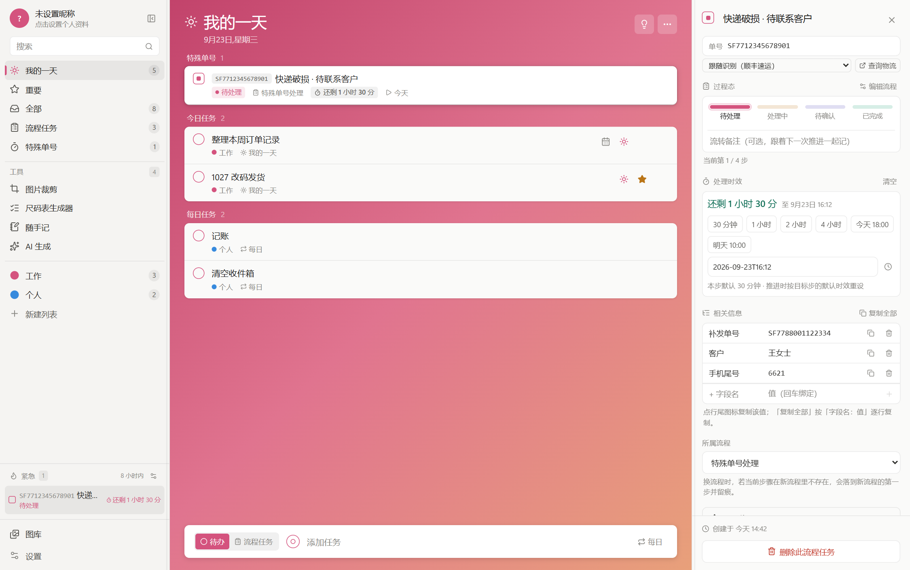 | 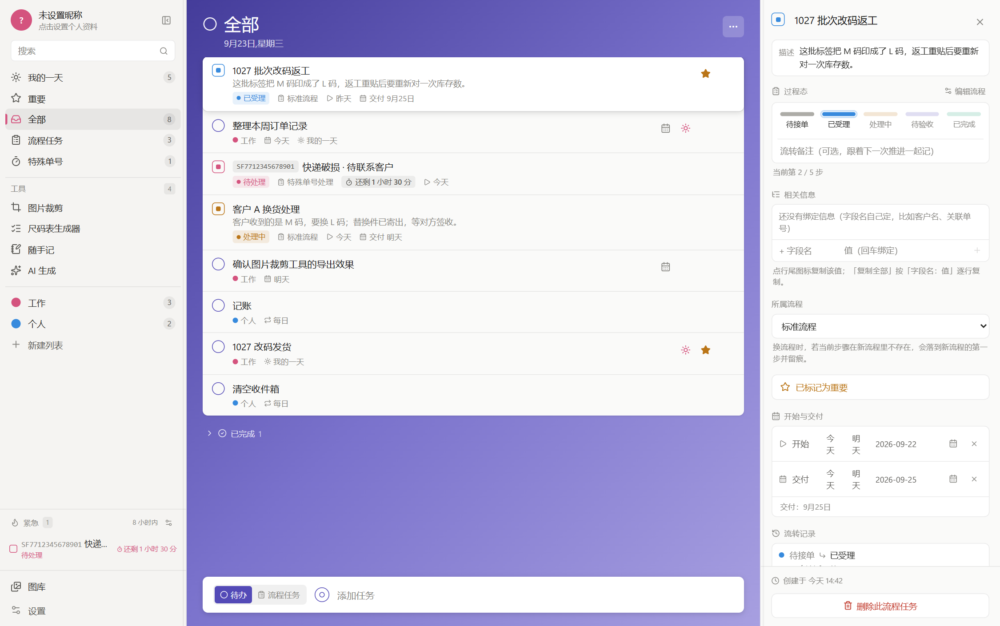 |

| 流程任务视图 | 流程任务详情 · 过程态流转留痕 |
| --- | --- |
| 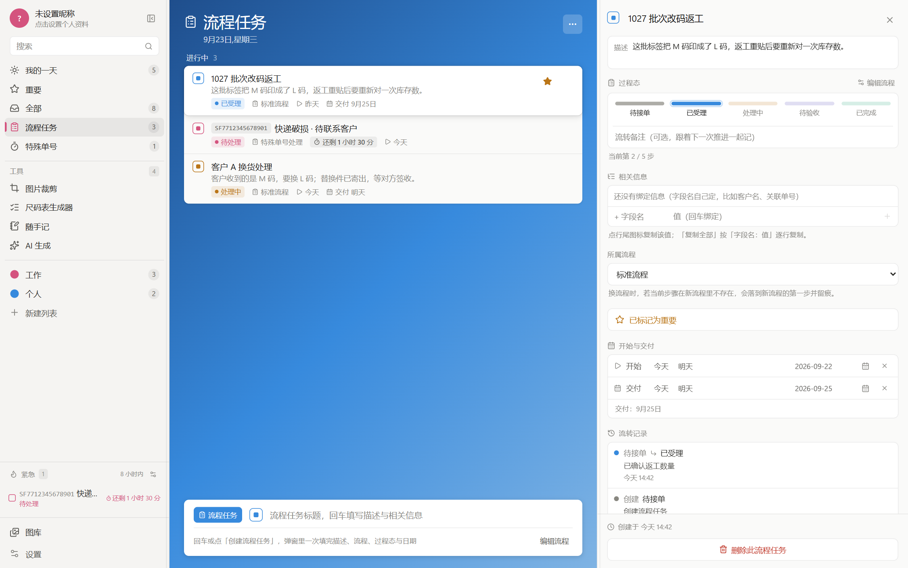 | 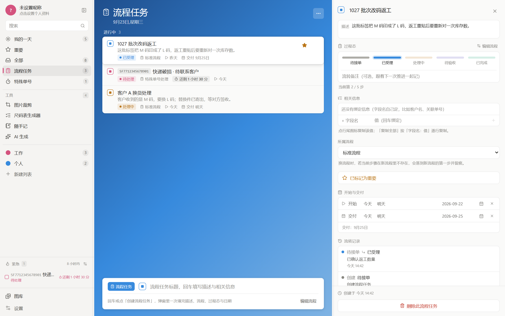 |

| 特殊单号 · 时效倒计时 | 图库 |
| --- | --- |
| 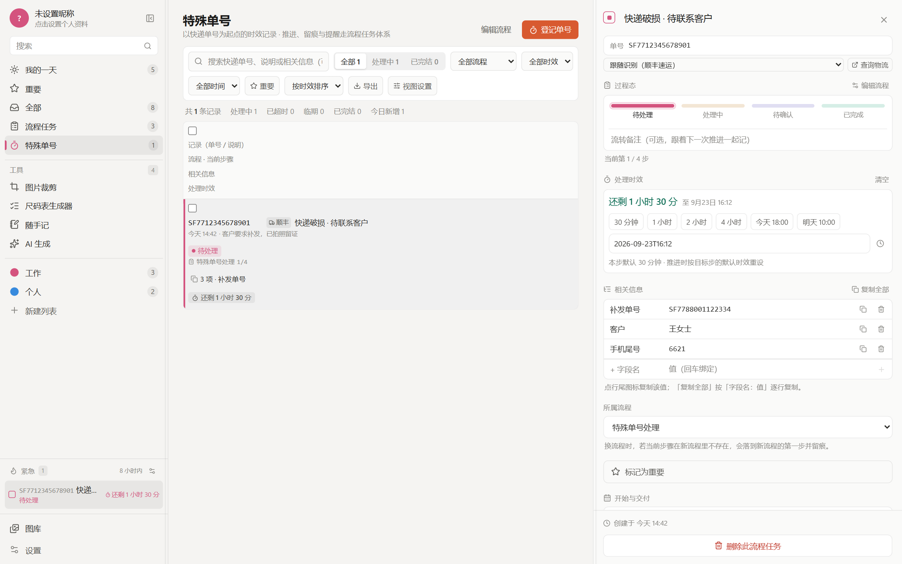 | 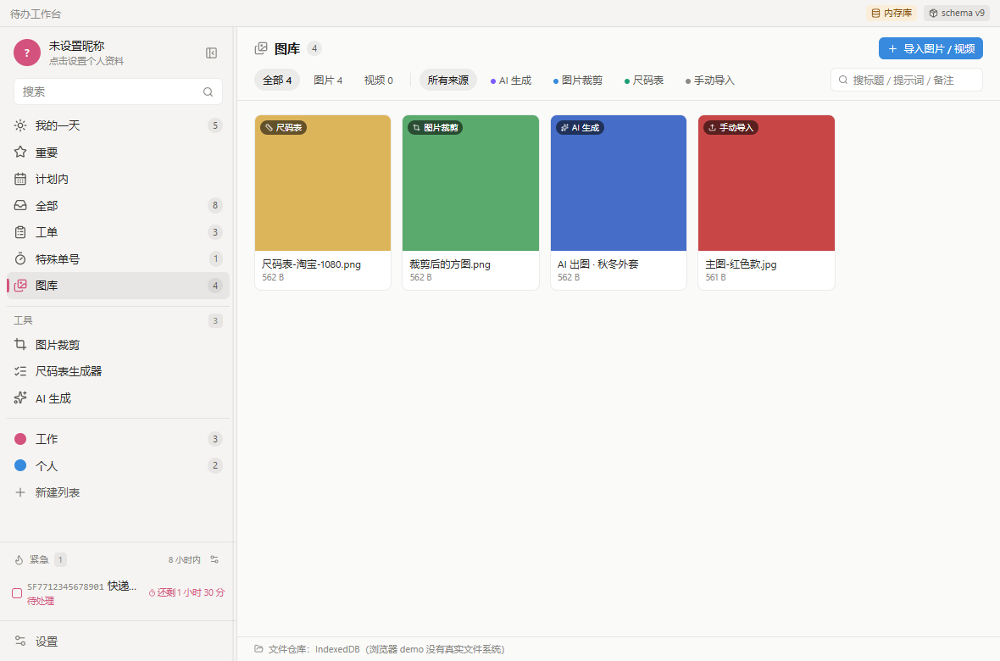 |

| 侧边栏紧急区（剩余时间不足自动聚合） | 左右面板宽度可拖拽 |
| --- | --- |
| 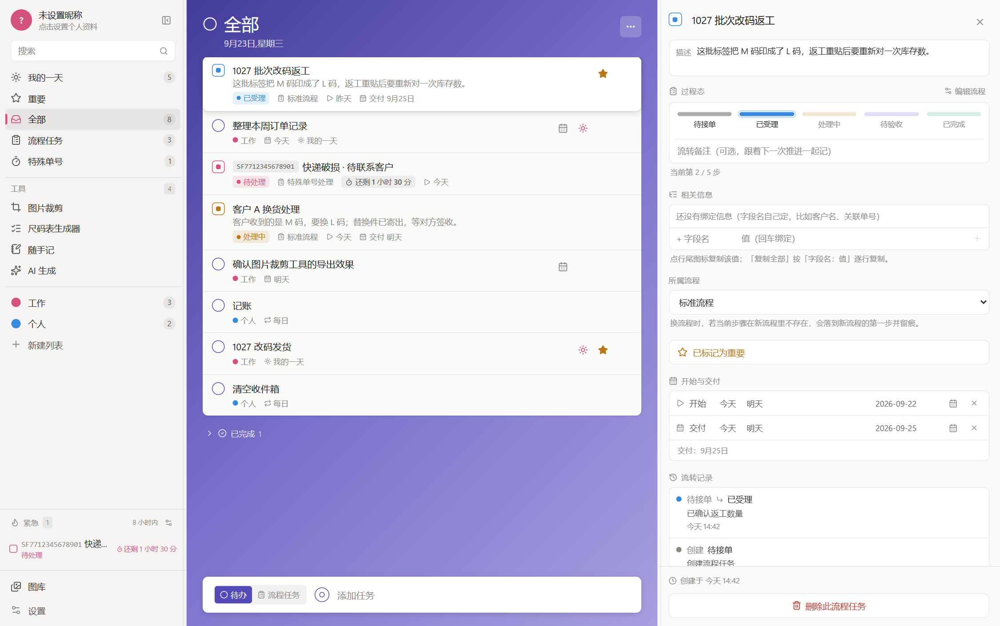 | 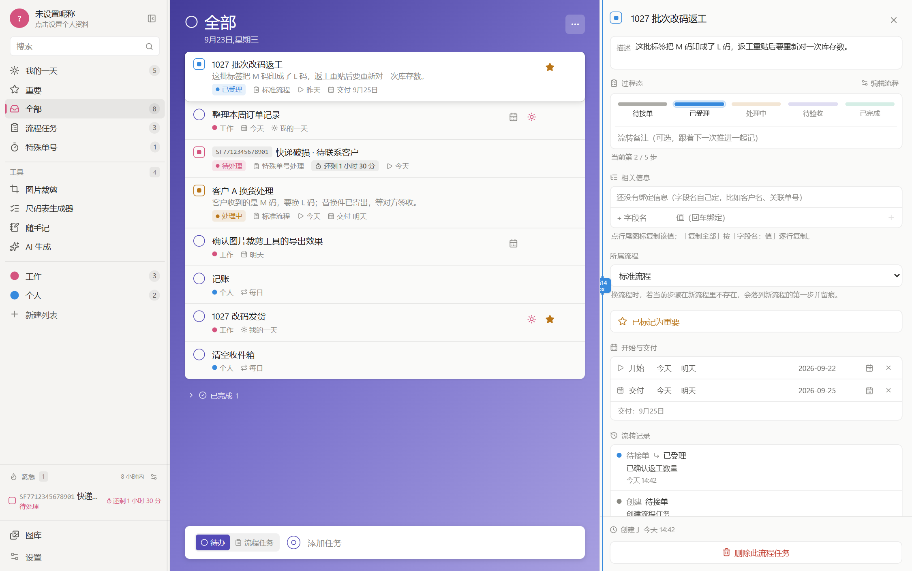 |

| 设置 · 工具（启用停用 / 安装卸载 / 导入单文件） | 设置 · 关于 |
| --- | --- |
| 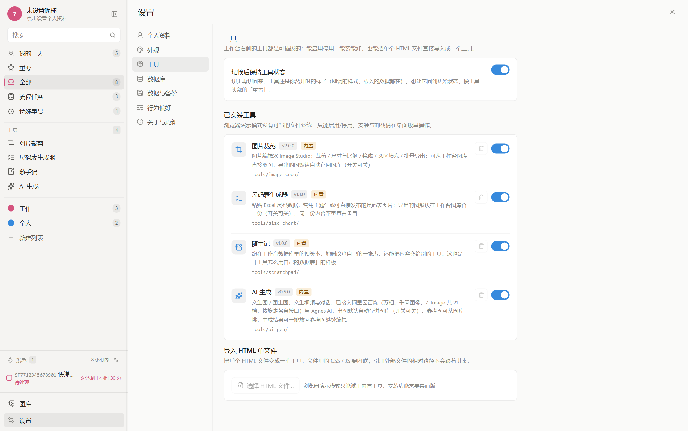 | 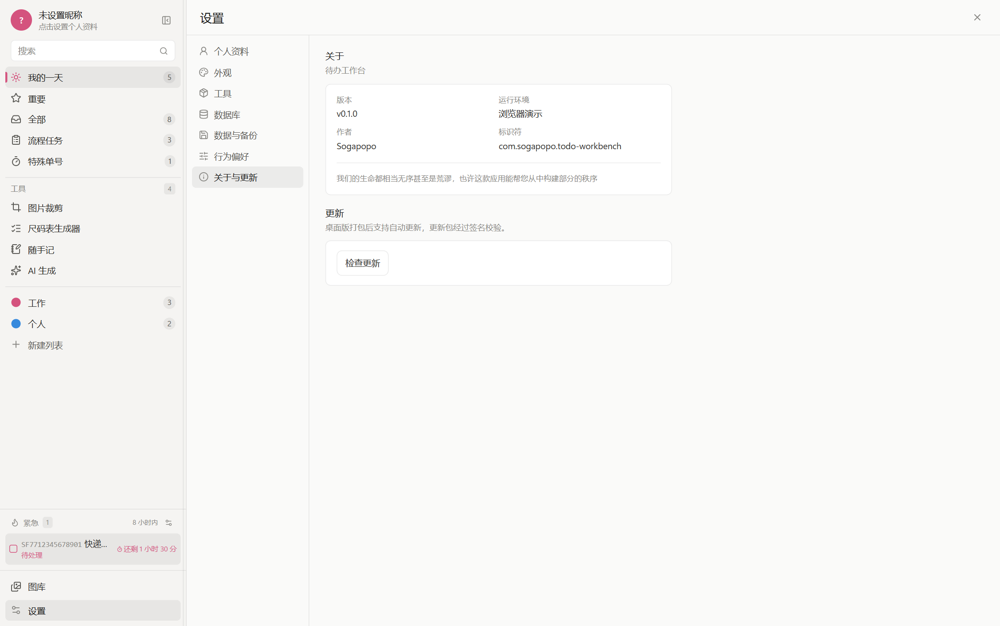 |

内置工具（都是完全自治的单页应用，共用同一个数据库）：

| 图片裁剪 · Image Studio | 尺码表生成器 |
| --- | --- |
| 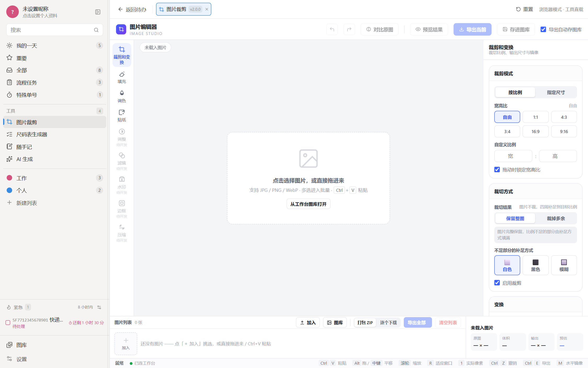 | 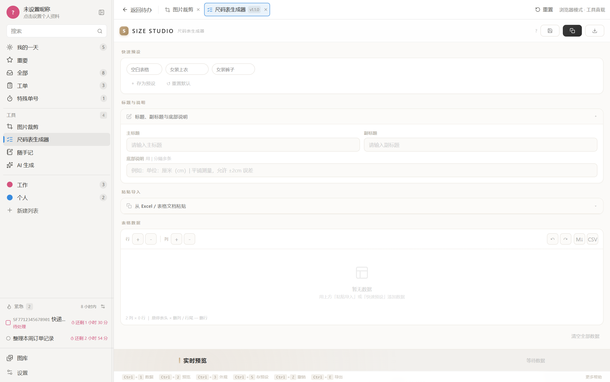 |

| 随手记 | AI 生成（多厂商可切） |
| --- | --- |
| 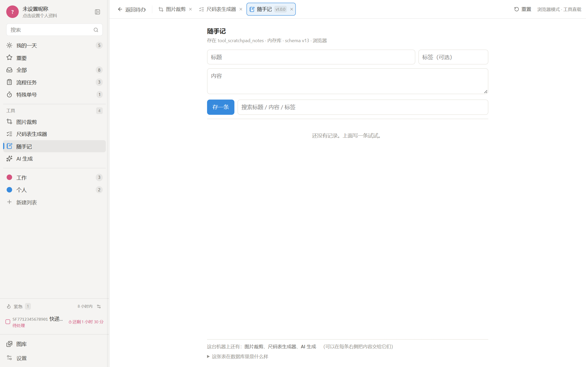 | 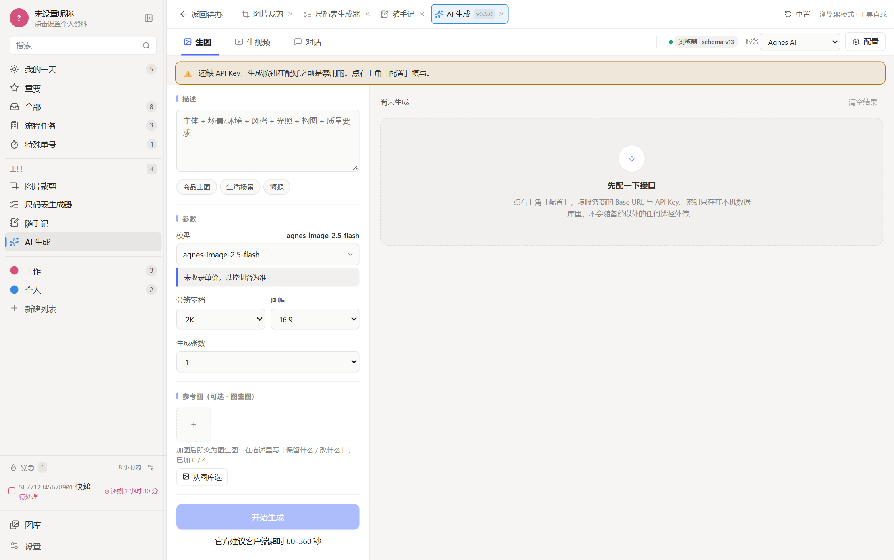 |

---

## 核心功能

### 待办

- **我的一天 / 重要 / 全部** 三个智能视图，外加自建清单
- **子任务**：可逐个勾选完成，可各自设到期时刻；任务被选中时行内展开，
  显示描述与前 3 条子任务（其余折成「……还有 N 项」）
- **重复规则**：每日任务的完成状态按**本地日期**记账（`repeat_done_on`），
  跨时区不会错位
- **截止日期与提醒**合成一张卡片；提醒到点弹系统通知
- **附件**：图片 / 文件拖进来即存，支持粘贴与灯箱预览
- **选中行整行浮起**（圆角 + 投影），不是左侧一条色带

### 流程任务与特殊单号

- 流程任务与待办**分表存储，只在展示层混排**——不会因为看到一条流程任务而把待办的数据模型污染
- 流程任务有**可定制流程**：过程态编辑走 `moveOrderToStage`，每次流转留痕
- 流程任务写的是**描述**（`description`）而不是单号 —— schema v13 起不再自动编号
  `WO-YYYYMMDD-NNN`。那个号用户手上没有对应的单据、对不上账，要写的是"这件事要办什么"；
  标题仍然保留（列表扫视用一行标题，展开说明放描述）。
  ⚠️ 老库里的 `WO-` 号**数据仍在**（没有做删除迁移），只是界面不再显示
- 两种流程任务都能绑**自定义键值**的「相关信息」（字段名由用户定，可一键复制单个值或全部）。
  搜索会跨标题、单号、描述与相关信息字段值
- **特殊单号**以快递单号起算，时效 =「距下一步骤的剩余时间」，流程可定制
- 逾期与临期各提醒一次，临近过期红色高亮
- ⚠️ **流程任务永不进「我的一天」**——那是待办的地盘

### 紧急区

三类来源统一聚合在侧边栏底部，怎么算集中在一个文件里（`src/lib/urgent.ts`）：

| 来源 | 取什么时间 |
|---|---|
| 待办 | 提醒时刻 / 到期日 |
| 流程任务 | 步骤时效 / 交付日 |
| 子任务 | 自己的 `due_at`（只认显式设了时刻的） |

阈值（提前多久算「紧急」）在设置里调，不是写死的。

### 工具是可配置的模块

设置 → 工具里每个工具一行。四件事刻意分开，别混为一谈：

| 维度 | 动的是什么 | 说明 |
|---|---|---|
| 启用 / 停用 | 配置 `tools.disabled` | 只是不在侧边栏出现，工具文件还在 |
| 安装 / 卸载 | `%APPDATA%/…/tools/<id>/` | 自己导入的工具删了就没了；内置工具删了能从安装包再装回来 |
| 保持状态 | 配置 `tools.keepState` | 默认开：切走再切回来还是你离开时的样子 |
| 关闭运行 | 本次会话的挂载集合 | 释放那个工具占用的内存与后台计算 |

工具的**数据表**与**互相调用**都走受控通道，不给 SQL 直连：每个工具有自己的
`tool_<id>_*` 前缀，跨工具调用走 `tools.list/open/send` 这类意图队列，
iframe 加载完成之后才投递（否则消息发给一个还不存在的窗口，静默丢掉）。

---

## 技术选型（已定稿）

| 层 | 选型 | 说明 |
|---|---|---|
| 桌面外壳 | Tauri 2.x | 复用系统 WebView2，宿主本体很轻 |
| 前端 | React 19 + TypeScript + Vite | |
| 样式 | Tailwind CSS v4 | 颜色/阴影一律走 `@theme` 语义令牌，禁裸 hex |
| 状态 | Zustand | 单 store，任务数据以数据库为准 |
| 数据库 | SQLite（tauri-plugin-sql） | 开 WAL，单文件可备份 |
| 打包 | NSIS | Windows 上不用 MSI |
| 更新 | tauri-plugin-updater | 静态 update.json + 签名 |

### 为什么不用 Electron

Electron 换来的是 Node 原生模块能力，而本项目的工具全部是浏览器端就能完成的事
（canvas 裁剪、表格导出、剪贴板）。为此付出约 180 MB 安装包和约 300 MB 内存不划算。
若将来需要 OCR、批量转码等重活，Tauri 2 可挂 Rust 库或 Python sidecar，无需更换外壳。

---

## 架构

### 双驱动数据库层

`src/lib/db.ts` 抽象出 `Db` 接口，有两个实现：

- `SqliteDb` —— Tauri 环境下的真实 SQLite
- `MemoryDb` —— 浏览器下的内存库，快照持久化到 localStorage

上层业务代码（`src/lib/repo.ts`）只依赖接口，不关心底层是哪种。
**这样"先在浏览器里跑 demo 验证产品形态"和"打包成桌面应用"用的是同一份业务代码。**

启动时通过 `__TAURI_INTERNALS__` 自动判定环境，无需手工切换。

> ⚠️ **MemoryDb 有硬限制，踩过一次**：它不支持 JOIN / 子查询 / 多聚合，
> 遇到这类 SQL 会**静默返回空**（不是报错）。所以取数一律"拆成单表查询 + 在 JS 里合并"。
> 桌面端的事务也**必须**走 Rust 侧的 `db_transaction` 命令，不能自己拼 BEGIN/COMMIT。

### 迁移规范（不可破坏）

数据库迁移从第一天就版本化（`PRAGMA user_version` + `src/lib/migrations.ts`），
**当前 schema = v13**：

| 版本 | 名称 | 内容 |
|---|---|---|
| 1 | `init_core_schema` | 清单 / 任务 / 子任务 / 设置 |
| 2 | `add_task_repeat` | 重复规则 |
| 3 | `add_task_links` | 任务间关联 |
| 4 | `add_special_orders_tool_schema` | 特殊单号（早期以工具形式承载） |
| 5 | `add_tool_kv_store` | 工具私有 KV |
| 6 | `add_work_orders` | 流程任务 |
| 7 | `add_wo_attachments` | 流程任务附件 |
| 8 | `add_special_orders_as_work_orders` | 特殊单号升格为流程任务的一类 |
| 9 | `add_gallery` | 图库 |
| 10 | `add_tool_schema_ledger` | 工具 schema 台账 |
| 11 | `add_wo_courier` | 流程任务的快递字段 |
| 12 | `add_step_due_at` | 子任务的到期时刻 |
| 13 | `add_wo_description` | 流程任务的描述（普通流程任务取消自动编号） |

四条铁律：

1. 只追加，已发布的迁移脚本**永不修改**——用户库里可能已经跑过它
2. 每个迁移是一个原子事务，失败整批回滚，绝不留半截 schema
3. 核心表用 `core_` 前缀，工具表用 `tool_<id>_` 前缀，两套迁移互不干扰
4. SQLite 的 `ALTER TABLE` 能力有限，涉及重建表时用
   "建新表 → 拷数据 → 删旧表 → 改名"四步法

### 工具装载子系统

工具契约：

```
tools/<id>/
  manifest.json    清单
  index.html       工具界面，完全自治的单页应用
```

`manifest.json`：

```json
{
  "id": "image-crop",
  "name": "图片裁剪",
  "version": "2.0.0",
  "icon": "crop",
  "entry": "index.html",
  "dbVersion": 1
}
```

扫描顺序（后者覆盖前者，便于用户替换内置工具）：

1. 安装包内 `<resources>/tools/`
2. 用户数据区 `%APPDATA%/com.sogapopo.todo-workbench/tools/`

**工具目录放用户数据区而非安装包，是"可更新"设计的一部分**：
新增工具只需往该目录丢一个文件夹，不必重新打包发版。

**「保持工具状态」是怎么做到的**：打开过的工具不卸载，只是隐藏 ——
iframe 的文档一直活着，里面的变量、DOM、滚动位置都还在。两个实现上的硬约束：

- **帧的 DOM 顺序必须稳定**。iframe 在 DOM 里挪一下（哪怕只是换了个兄弟顺序），
  浏览器就会重新加载它，状态照样丢。所以按打开顺序渲染，用 CSS 切换可见性，
  绝不按"当前是否活跃"重排。
- **同一时刻只能有一个工具头部**。头部画在每个帧里面的话，隐藏的帧会各留一个
  `<header>`，自动化里 `locator("header").last()` 就会抓到隐藏的那个。

想回到初始态，按工具头部的「重置」；关掉这个开关则退回"切走即卸载"。

**内置工具的卸载为什么要多一个清单文件**：启动时 Rust 会把安装包里内置工具
同步到用户数据区（这正是"新增工具不必重新发版"的前提），所以只删目录的话，
下次开机会自己回来。因此卸载内置工具要同时往 `<appData>/tools/.uninstalled`
记一笔，Rust 侧同步时跳过清单里的 id。

**单文件导入**：设置 → 工具 → 选择 HTML 文件 → 确认名称与 id 即可。
CSS/JS 必须内联，相对引用不会跟着进来（原因见 `ToolHost` 里那段 asset 协议说明）。

**内置工具一览**：

| 工具 | 版本 | 做什么 |
|---|---|---|
| 图片裁剪 | 2.0.0 | 裁剪 / 尺寸与比例 / 镜像 / 选区填充 / 批量导出；可存进工作台图库、可从图库自取；本地 AI 补全（模型随包分发，无需联网） |
| 尺码表生成器 | 1.1.0 | 粘贴 Excel 尺码数据生成尺码表；导出的图能存进工作台图库 |
| 随手记 | 1.0.0 | 跑在工具表数据库上的便签本，也是"工具怎么用自己的数据表"的样例 |
| AI 生成 | 0.5.0 | 文生图 / 图生图 / 生视频与对话；已接入阿里云百炼（万相、千问图像、Z-Image 共 21 档，按族走不同接口）与 Agnes；出图可自动存图库 |

> 加一家服务商 = 往 `PROVIDERS` 里加一个对象，UI 不用改。描述符里的可选键就是扩展点：
> 生图用 `async`，生视频用 `headers` + `pollPathFor`
> （**有它就按 task_id 轮询，没有才走 Agnes 的 video_id 查询串**）。

### 数据隔离

所有表在同一数据库文件中，但命名空间严格分开：

- `core_*` —— 宿主核心（`core_lists` / `core_tasks` / `core_steps` / `core_settings` 等）
- `tool_<id>_*` —— 各工具私有表，由 `toolTable()` 强制生成前缀

卸载或回滚某个工具，不影响待办数据。

### 更新机制（两层）

**第一层，应用本体升级。** `tauri-plugin-updater` + Minisign 签名 + 静态 `update.json`。

安装包与 `update.json` 一起挂在 **GitHub Releases**，客户端拉的是固定转发地址：

```
https://github.com/baicaibucai1/todo-workbench/releases/latest/download/update.json
```

`latest/download` 永远指向最新正式版，所以**发新版只需新建 Release，不用动客户端地址**。
清单里带安装包的签名与下载地址，客户端验签通过才安装；`installMode = passive`
即静默下载 + 提示重启，不做强制更新。

⚠️ **签名私钥必须离线备份**（本机 `.tauri-key`）——私钥丢失后，
再也发不出能被老版本接受的更新，用户只能手动重装。

**第二层，工具与数据结构独立演进。** 工具目录放用户数据区（见上），
数据库迁移版本化（见「迁移规范」）。
一旦用户已有数据再补迁移机制，就只能手工修库了。

---

## 目录结构

```
main/
  src/
    lib/
      db.ts            数据库抽象层（双驱动）+ 迁移执行
      migrations.ts    版本化迁移定义（当前 v13）
      repo.ts          业务数据仓库
      rows.ts          列表分组与排序（"默认展开第一条"同源）
      urgent.ts        紧急区取数（待办 / 流程任务 / 子任务三类来源）
      tools.ts         工具扫描与校验
      toolBridge.ts    工具与宿主的受控通道
      toolStore.ts     工具私有表读写
      settings.ts      设置键与默认值（禁裸字符串键）
      detailSections.ts 详情面板分区顺序
      rowStyle.ts      列表行表面样式（选中浮起等共用规则）
      datetime.ts      时间转换与格式化
      couriers.ts      快递公司表
      special.ts       特殊单号业务规则
      gallery.ts       图库
      attachments.ts   附件
      notify.ts        系统通知
      wallpapers.ts    壁纸
      icons.ts         图标名映射
    components/
      Sidebar.tsx      侧边栏（智能视图 + 工具区 + 清单 + 紧急区）
      TaskList.tsx     任务列表主体
      TaskRow.tsx      单条待办（含展开子任务）
      OrderRow.tsx     单条流程任务
      TaskDetail.tsx   右侧常驻详情面板
      OrderDetail.tsx  流程任务详情
      SpecialOrdersView.tsx  特殊单号专用视图
      GalleryView.tsx  图库
      Settings.tsx     设置（七个分区）
      UrgentPanel.tsx  紧急区
      ToolHost.tsx / ToolArea.tsx  工具容器与标签条
      FlowEditor.tsx   流程模板编辑器
      ...
    store.ts           Zustand 全局状态
    types.ts          数据模型
  tools/              内置工具（随安装包分发）
    image-crop/  size-chart/  scratchpad/  ai-gen/
  tests/              单测与 e2e
  src-tauri/          Rust 端：插件注册、工具同步、打包配置
```

---

## 怎么启动

### 只是想用：直接下载安装包

到 [**Releases**](https://github.com/baicaibucai1/todo-workbench/releases/latest) 下载
`todo-workbench_x.y.z_x64-setup.exe`，双击安装 —— **不装 Node、不装 Rust、
不需要管理员权限**（`installMode = currentUser`，装进用户目录），
装完就是上面截图里的样子。之后应用会自己去 Releases 拉 `update.json` 检查新版本。

### 想改代码：双击脚本

| 脚本 | 用途 | 前置条件 |
|---|---|---|
| **`启动开发版.bat`** | 浏览器里跑，秒开，改代码即时生效 | 只需 Node.js |
| **`启动桌面版.bat`** | 真正的桌面窗口（Tauri 原生窗口） | 还需 Rust 工具链 |
| **`打包桌面版.bat`** | 打成 NSIS 安装包 + 更新清单 | 同上 |
| **`安装Rust环境.bat`** | 装 Rust（可选 GNU 或 MSVC 路线） | 需手动点 UAC |
| **`安装MinGW环境.bat`** | GNU 路线所需的 MinGW 安装指引 | 需手动操作 |
| **`安装C++生成工具.bat`** | MSVC 路线所需的 VS 生成工具 | 需手动点 UAC |

所有脚本都会自己检查环境、缺依赖时自动安装、并给出明确提示。
**推荐先用「启动开发版」**——它不需要 Rust，能立刻看到完整界面。

### 三条路线怎么选

编译 Rust 需要一个链接器，有两个来源，选一个即可：

| 路线 | 需要装什么 | 体积 | 说明 |
|---|---|---|---|
| **GNU（推荐）** | MSYS2 + MinGW-w64 | 约 100 MB | 自带链接器，不用装 Visual Studio |
| MSVC | Visual Studio C++ 生成工具 | 2–4 GB | Tauri 官方推荐，兼容性最好 |

**GNU 路线**的完整步骤：

1. 双击 `安装MinGW环境.bat`，按里面的指引装好 MSYS2
2. 双击 `安装Rust环境.bat`，选 `1`（GNU）
3. 运行 `npm run setup:gnu` 让脚本自动探测路径并生成 Cargo 配置

GNU 路线有一个 Windows PE 格式的固有限制：DLL 导出符号序号不能超过 65535，
而 Tauri 依赖的 `windows` crate 符号数远超此限。`setup:gnu` 生成的配置里带了
`-Wl,-exclude-all-symbols` 参数来解决它 —— GNU `ld` 2.4x **原生支持**该参数，
所以**不需要装 lld**（省掉约 1 GB 的 LLVM）。

想改回 MSVC：`npm run setup:gnu -- --off` 会禁用该配置。

### `.bat` 必须保持「纯 ASCII + CRLF」

**这是本项目最容易踩、也最隐蔽的一个坑。** 三条规则各有原因：

| 规则 | 违反后的症状 |
|---|---|
| **纯 ASCII** | 中文 `echo` 行被拆成乱码命令，报一堆「不是内部或外部命令」 |
| **CRLF 换行** | 多行块 `if (...) (` 被拆散 |
| **不带 BOM** | BOM 被当成第一个命令的一部分 |

最关键的是第一条。原因：**cmd.exe 按字节偏移定位批处理文件里的行**，
多字节字符会让偏移逐渐错位，迟早有一行被切在半个字符中间。
实测数据（同一份内容，`CMD /D /C` 直接跑）：

| 编码 | 大小 | 结果 |
|---|---|---|
| **纯 ASCII + CRLF** | 5733 B | ✅ 69/69 行正常，stderr 全空 |
| UTF-8 无 BOM + CRLF | 8318 B | ❌ 只有 19/69 行，大量乱码命令 |
| GBK + CRLF | 5845 B | 能跑，但会和 Node 的 UTF-8 输出冲突 |
| UTF-8 带 BOM | — | ❌ BOM 被当成命令名 |
| ASCII 外层先 `chcp 65001` 再 `call` 内层 | — | ❌ 仍然 19/69，无效 |

注意第二行：**UTF-8 中文的 .bat 在小文件时碰巧能跑**，
所以这个问题很容易被漏掉 —— 但「碰巧能跑」不是可以依赖的性质。

**所以本项目的架构是：`.bat` 只做薄启动器（纯 ASCII），
所有中文提示与业务逻辑由 Node 脚本负责**
（Node 写 UTF-8 字节，配合 `.bat` 里的 `chcp 65001` 正常显示）。

```
打包桌面版.bat        ->  node scripts\pack.mjs          （完整打包流程）
启动开发版.bat        ->  node scripts\launchers.mjs dev
启动桌面版.bat        ->  node scripts\launchers.mjs desktop
安装Rust环境.bat      ->  node scripts\launchers.mjs install-rust
安装MinGW环境.bat     ->  node scripts\launchers.mjs guide-mingw
安装C++生成工具.bat   ->  node scripts\launchers.mjs guide-msvc
```

加新的 `.bat` 时照抄这个形状即可：

```bat
@echo off
chcp 65001 >nul
cd /d "%~dp0"
node scripts\你的脚本.mjs
pause
```

检查与修复：

```bash
npm run bat:check   # 检查全部，不合格退出码 1
npm run bat:fix     # 自动修 CRLF 与 BOM（非 ASCII 只能人工处理）
```

`npm run env:check` 也会把它列为阻断项。
详细推导见 `scripts/bat-lint.mjs` 与 `scripts/pack.mjs` 顶部的注释。

### `.bat` 会自己补齐 PATH

`启动桌面版.bat` / `打包桌面版.bat` 不依赖你的系统 PATH，开跑前会调用
`scripts/toolchain-path.mjs` 把需要的目录加进去，原因有两个：

- `%USERPROFILE%\.cargo\bin` —— rustup 会写进持久 PATH，但**装完不重开窗口就取不到**
- MinGW 的 `bin` —— **一定不在 PATH 里**（我们是解压在用户目录的）。
  而 GNU 目标下 `embed-resource` 是用裸命令名 `windres` 去调它的，
  找不到就直接编译失败

所以装完 Rust 后**不需要重开命令行窗口**，直接重新运行脚本即可。
MinGW 的路径从 `src-tauri/.cargo/config.toml` 里的 `linker` 读，那是单一数据源。

### 签名密码不能在 `.bat` 里设

cmd 里 `set "TAURI_SIGNING_PRIVATE_KEY_PASSWORD="` 是**删除变量**，
不是「设为空字符串」。少了密码，Tauri 会转成交互式索要 ——
实测变量缺失时挂起 12 秒仍未返回，双击运行时表现为**打包完成后无限期卡住**。

```bash
# 实测（tauri signer sign）
变量缺失      -> 挂起 12s 未返回
空字符串 ""   -> 244ms 签名成功
```

所以签名必须由 Node 来设（`process.env.X = ""` 才是真正的空字符串）。
`scripts/build-desktop.mjs` 已经处理好这件事。

### 手动命令

```bash
npm install          # 首次运行，装依赖（约 30 秒）
npm run dev          # 浏览器模式 → http://localhost:1420
npm run tauri dev    # 桌面模式（需 Rust）
npm run tauri build  # 打包成 NSIS 安装包
```

> 手动跑 `npm run tauri build` 时会提示输入密码 —— **直接回车**即可
> （当前签名密钥的密码是空字符串）。
> 更省事的做法是用 `npm run build:desktop`，它会把 PATH、签名密码、
> WebView2Loader.dll 都处理好，不会弹提示。

浏览器模式下用内存库（数据存在 localStorage）；桌面模式下自动切换为
SQLite 文件数据库。**两个模式共用同一份业务代码**，所以浏览器里验证过的功能，
打包后行为一致。

装完 Rust 后**必须重新打开命令行窗口**（环境变量需要刷新），否则会提示找不到 cargo。

首次 `npm run tauri dev` 要编译 Rust 依赖，约 3–10 分钟；之后增量编译只需几秒。

### 发版：把安装包发成 Release

```bash
node scripts/build-desktop.mjs          # 1. 打包（产出 *-setup.exe 与配对 .sig）
node scripts/publish-release.mjs        # 2. 发布：改名 → 生成 update.json → 建 Release → 上传 → 匿名验证
node scripts/publish-release.mjs --dry  # 只看计划，不发
```

发布脚本负责三件最容易漏的事：

| 事 | 为什么必须由脚本做 |
|---|---|
| **资产名改 ASCII** | GitHub 会**丢掉** assets 上传 URL 里 `?name=` 的非 ASCII 字符：「待办工作台_0.1.0_x64-setup.exe」被存成「_0.1.0_x64-setup.exe」，于是 update.json 里的下载地址 404，而客户端是**静默**失败 |
| **三样一起换** | 安装包 / `.sig` 签名 / `update.json` —— 漏签名老版本拒绝安装，漏换清单客户端就一直以为已是最新 |
| **匿名验证** | 只看带凭据的 API 返回不算数；脚本会以匿名身份拉一次 `latest/download/update.json`，并检查安装包确实是 PE 文件 |

发一个新版本只需要三步：把 `src-tauri/tauri.conf.json` 的 `version` 改高 →
重新打包 → 再跑一次发布脚本。客户端地址是 `releases/latest/download/update.json`
（固定转发），**任何配置都不用改**。

---

## 项目自检

**不确定环境缺什么？先跑这个：**

```bash
npm run env:check    # 环境自检，逐项报告缺什么、怎么补
```

它只读不写，不会安装或修改任何东西，最后给出一份纯文本报告。

改完代码想确认没弄坏东西，按这个顺序跑：

```bash
npm run typecheck      # TypeScript 类型检查，应 0 错误
npm run smoke          # 逻辑单测，无浏览器（数据库层 / 仓库层 / 设置 / 分区排序 …）
npm run icons:check    # 图标格式校验（PNG 结构 + ICO 各帧）
npm run webview2:check # 校验 WebView2Loader.dll 与 Rust 依赖版本一致
npm run bat:check      # .bat 规范检查（纯 ASCII + CRLF + 无 BOM）

# 浏览器 e2e（另开一个窗口跑 dev server，然后）
node tests/_run-all-e2e.mjs      # 全量，17 个套件一次跑完
node tests/task-detail.mjs       # 也可以单跑某一个套件
```

### 测试现状

| 层 | 规模 | 命令 |
|---|---|---|
| 类型检查 | 0 错误 | `npm run typecheck` |
| 逻辑单测（smoke） | **519 项** | `npm run smoke` |
| 浏览器 e2e | **17 套件 / 1005 项** | `node tests/_run-all-e2e.mjs` |

e2e 用本机 Edge（与 Tauri 的 WebView2 同源），覆盖 17 个面：

```
task-detail    选中浮起 / 详情与列表同源 / 分区排序
todo-extras    行内展开子任务 / 子任务时间
daily-settings 我的一天分组 / 重复 / 设置持久化 / 关于页
background     壁纸与主题
tool-browser   工具装载 / 状态保持 / 单文件导入
tool-database  工具私有表与跨工具调用
image-crop-ai  图片工具与本地 AI
placeholder-tools  占位工具
ai-gen         AI 生成（多厂商切换 / 异步轮询 / 真实连通性）
cross-origin-bridge  跨源工具桥（只在装出来的应用里能复现的那类断链）
gallery / wallpapers / attachments  图库 / 壁纸 / 附件
orders-view    流程任务视图
special-orders 特殊单号
urgent         紧急区三类来源
panel-resize   面板拖拽
```

> 大规模改动（加工具、动取数层、改数据模型）跑**全量**。
> 只改一处 UI 时可以单跑受影响的套件，省时间。

### 重拍 README 截图

界面改了之后，README 里的图要跟着更新：

```bash
node tests/gen-readme-shots.mjs   # 清演示库 → 逐视图截图 → 写 docs/screenshots/
node tests/gen-about-shot.mjs     # 单拍「设置 → 关于」
```

### 图标

应用图标由 `npm run icons` 生成，**不依赖任何第三方库**——
PNG 与 ICO 的编码是 `scripts/gen-icons.mjs` 里用内置 `zlib` 手写的。

```bash
npm run icons        # 重新生成 src-tauri/icons/ 下全部 14 个文件
npm run icons:check  # 校验生成的 PNG 结构、ICO 各帧、以及配置引用是否齐全
```

想换设计：改 `gen-icons.mjs` 里的 `renderIcon()`（大尺寸）与 `renderSmallIcon()`
（小尺寸，勾线更粗、不加装饰细节）两个函数即可。

---

## 待办事项

- [x] 生成 updater 签名密钥并填入 `tauri.conf.json` 的 `pubkey`
- [x] 补齐应用图标（14 个文件，含多尺寸 ICO）
- [x] 环境自检脚本 `npm run env:check`
- [x] GNU 工具链配置脚本 `npm run setup:gnu`
- [x] **跑通首次桌面打包**（无提权）
- [x] **修复「装得上但启动报找不到 WebView2Loader.dll」**（DLL 未被打进安装包）
- [x] **修复 6 个 `.bat` 在 cmd 下被解析成乱码**（改为纯 ASCII 启动器 + Node 实现）
- [x] **修复打包完成后因签名密码提示而卡死**（cmd 的 `set "VAR="` 会删除变量）
- [x] **实机安装并跑通**：应用正常启动 + 工具目录同步 + SQLite 落盘
- [x] 任务详情面板（子任务、备注、截止日期与提醒）
- [x] 系统通知提醒（`notify.ts`；拿不到权限时用应用内提醒卡片兜底）
- [x] 流程任务与特殊单号（可定制流程、过程态留痕、时效倒计时）
- [x] 图库与附件
- [x] 工具的数据表、互相调用、设置里的数据库浏览
- [x] 侧边栏紧急区（三类来源统一聚合）
- [x] **发布首个 Release（v0.1.0）**：安装包 + `.sig` 签名 + `update.json` 一起挂在 Releases，
      `releases/latest/download/update.json` 作为固定的更新源（发新版不用改客户端）
- [ ] 列表内拖拽排序（当前排序规则固定：重要 / 到期 / 创建）

---

## 环境搭建（无需管理员权限）

本项目已跑通**全程不需要提权**的打包流程，工具链全部落在用户目录：

| 组件 | 位置 | 说明 |
|---|---|---|
| Rust 1.98.1 | `%USERPROFILE%\.cargo` | rustup 默认就装用户目录，不需要管理员 |
| MSYS2 | `%USERPROFILE%\msys64` | 用免安装的 `tar.xz` 解压，不用官方安装程序 |
| MinGW-w64 (gcc 16.2) | `%USERPROFILE%\msys64\mingw64` | 直接解压软件包，绕开 pacman |

换机器或重装时，按顺序跑：

```bash
npm run setup:rust      # 装 Rust（GNU 目标）
npm run fix-rust-shims  # 修复 0 字节 shim（见下方第 1 条）
npm run setup:msys2     # 下载并解压 MSYS2
npm run setup:mingw     # 装 MinGW-w64 工具链
npm run setup:gnu       # 生成 Cargo 配置
```

### 三个真实踩过的坑

1. **`.cargo/bin` 下 13 个 shim 是 0 字节。**
   rustup 正常用 hardlink 创建它们，某些文件系统上会失败，
   于是 `cargo` / `rustc` 报 `EFTYPE`。
   修法是把 `rustup.exe` 复制成那些名字——rustup 靠 `argv[0]` 判断自己要扮演哪个工具。

2. **pacman 的 GnuPG 密钥环初始化会卡死。**
   所以不走 pacman，改成直接解压 MSYS2 软件包（`.pkg.tar.zst`，
   本机 `bsdtar` 内置 zstd 支持），依赖从包内 `.PKGINFO` 的 `depend =` 字段递归解析。

3. **GNU 工具链的产物路径带 target triple。**
   安装包在 `src-tauri/target/x86_64-pc-windows-gnu/release/bundle/nsis/`，
   不是 `src-tauri/target/release/bundle/nsis/`。
   用 `npm run build:status` 自动定位，不要手写路径。

### 不需要 LLD

MinGW 构建 DLL 时默认导出全部符号，而 Windows PE 限制导出序号 ≤ 65535，
Tauri 依赖较多会触发 `export ordinal too large`。
GNU `ld` **原生支持 `--exclude-all-symbols`**（`setup:gnu` 已写入配置），
所以不需要安装 LLD / LLVM，省掉约 1 GB。

### GNU 路线特有的坑：WebView2Loader.dll 必须随安装包装上

**症状**：安装包能正常装完，双击图标却弹窗「找不到 WebView2Loader.dll」。

**原因**：`webview2-com-sys` 在 `-gnu` 目标下是**动态**链接这个 DLL 的
（`todo-workbench.exe` 的 PE 导入表里它是第一个静态导入项），
应用启动时必须在 **exe 同级目录**找到它。

`tauri-build` 其实知道这件事——它的 build.rs 里有一段 `gnu` 分支，
会把 DLL 从依赖的 out 目录拷到 `target/<triple>/release/`。
但它**只拷到 target 目录，没有把 DLL 加进 `bundle.resources`**，
于是 NSIS 打包器完全不知道要装它：生成的 `installer.nsi` 里连一个 `.dll` 都没有。
这是 Tauri 对 GNU 目标的遗漏，不是本项目的配置错误。

**解法**（已落地，无需手工干预）：

1. DLL 的源文件放在 `src-tauri/WebView2Loader.dll`
2. 在 `tauri.conf.json` 的 `bundle.resources` 里声明 `"WebView2Loader.dll"`
   —— List 形式下资源目标路径 = 源路径，所以它会正好装到 `$INSTDIR\WebView2Loader.dll`
3. `scripts/sync-webview2-loader.mjs` 负责让这份源文件与 `Cargo.lock` 锁定的
   `webview2-com-sys` 版本保持一致，避免手工拷贝导致版本漂移

```bash
npm run webview2:sync    # 同步（缺失或哈希不符时自动拷贝）
npm run webview2:check   # 只校验，不一致则退出码 1
```

`setup:gnu`、`打包桌面版.bat`、`build:desktop` 三处都会自动跑同步，
`env:check` 还会额外校验「文件在 + 配置里声明了」两件事，缺任何一件都算阻断项。

> 顺带排除过的隐患：Rust 的 GNU 目标会**静态**链接 `libgcc_s_seh-1.dll` /
> `libwinpthread-1.dll` / `libstdc++-6.dll`（exe 里搜不到这些名字），
> 所以 `WebView2Loader.dll` 是唯一的非系统库依赖，补上它就不会再有后续缺 DLL 的问题。

### 编译很慢是正常的

`Cargo.toml` 的发布配置用了 `lto = true` + `codegen-units = 1`，
这是「把可执行文件做到最小」的极限设置，首次全量编译约 **25–30 分钟**。
想快可以改成 `lto = "thin"` + `codegen-units = 16`。

期间没有输出是正常的，用这个看进度：

```bash
npm run build:status
```

---

## 许可与致谢

- 作者：Sogapopo
- 应用图标与壁纸的生成 / 抓取脚本均在本仓库内，**不依赖第三方图标库**
- 图片工具的本地 AI 推理基于 ONNX Runtime Web 与开源去背景模型，
  许可证文件随模型一同分发（`tools/image-crop/ai/LICENSE.txt`）